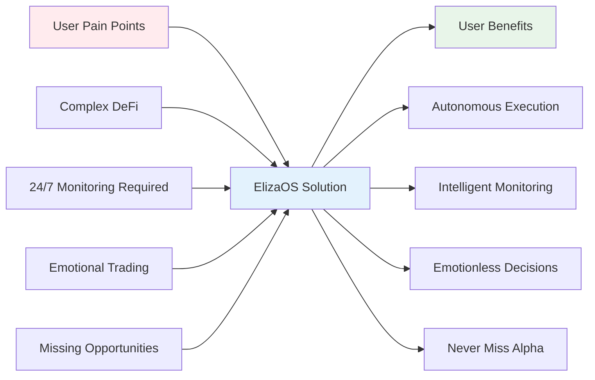
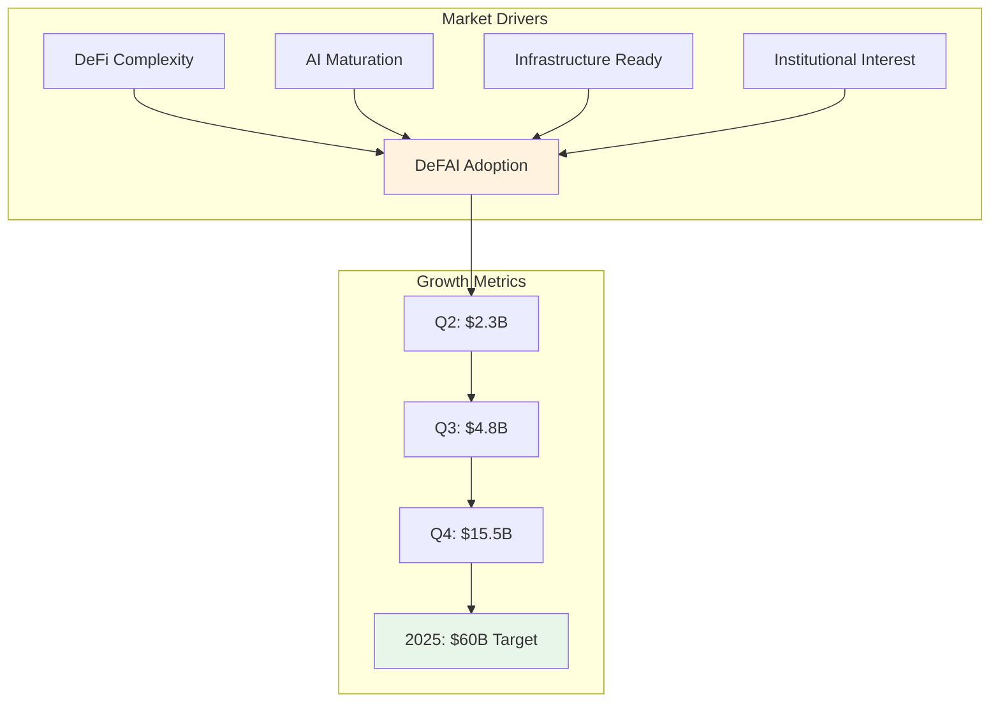
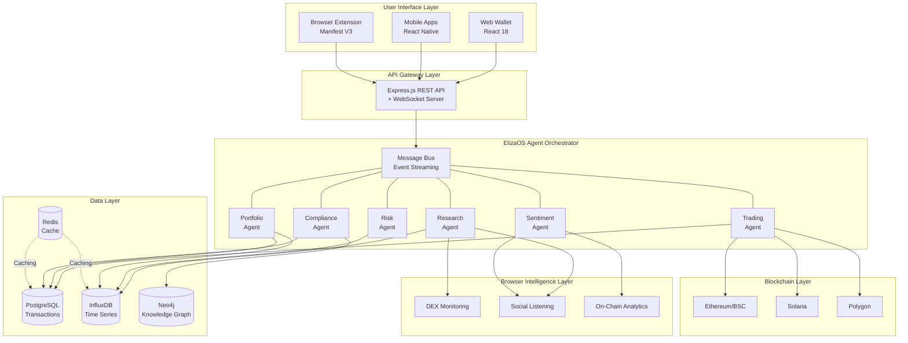
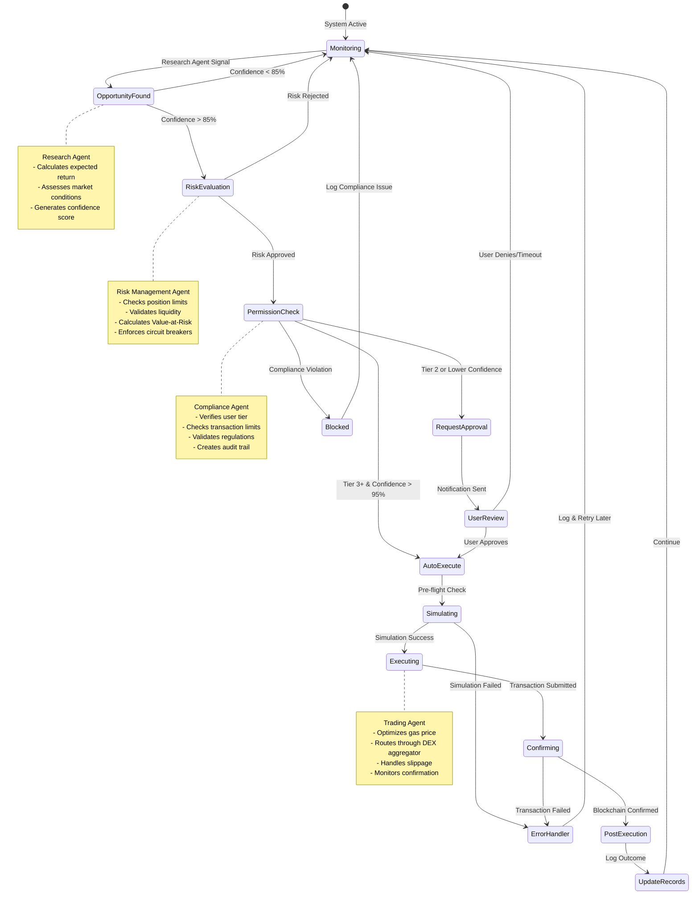
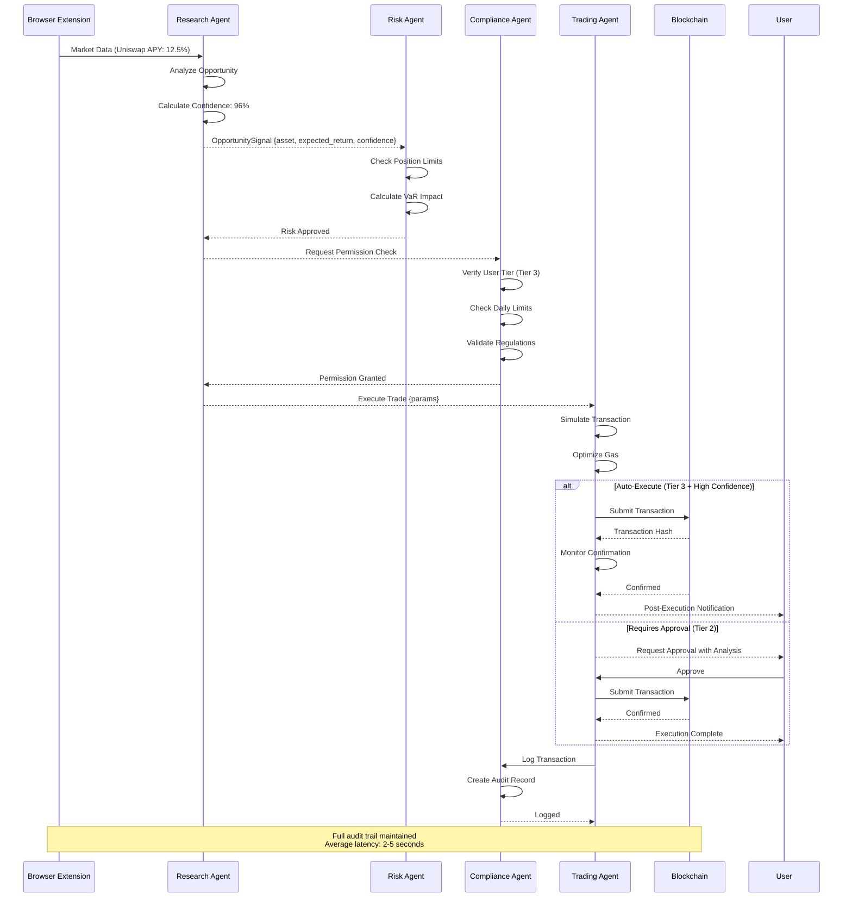
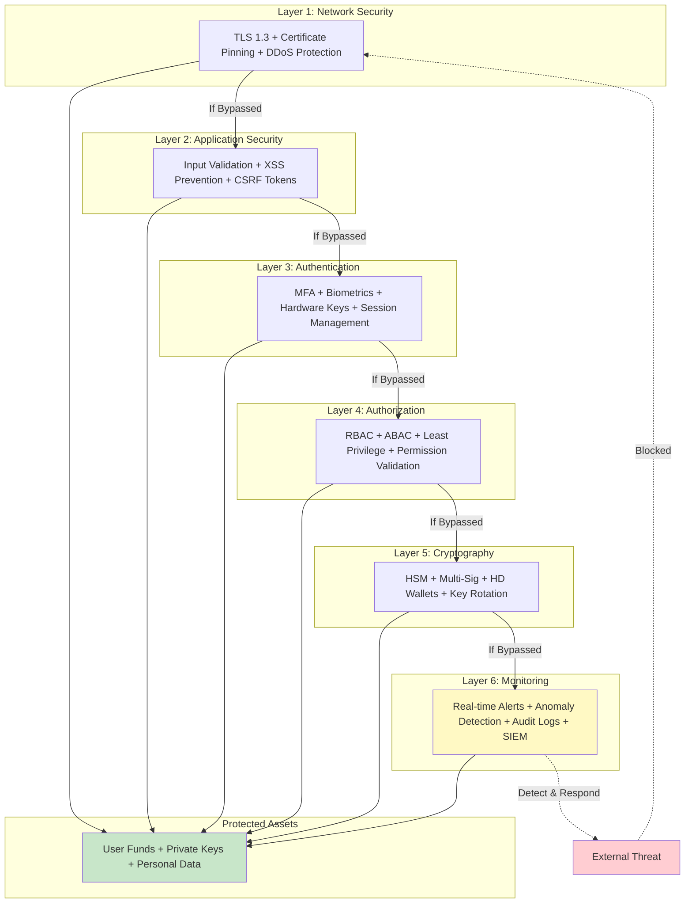
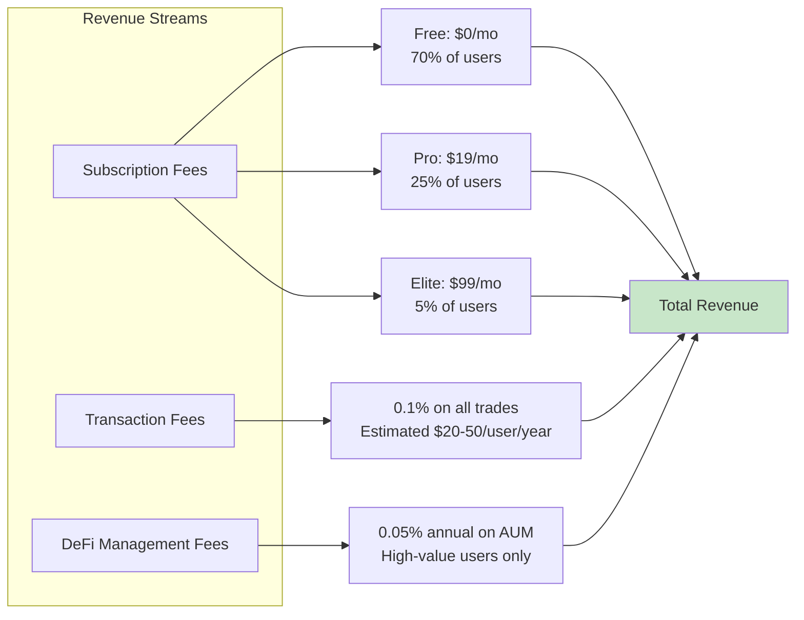
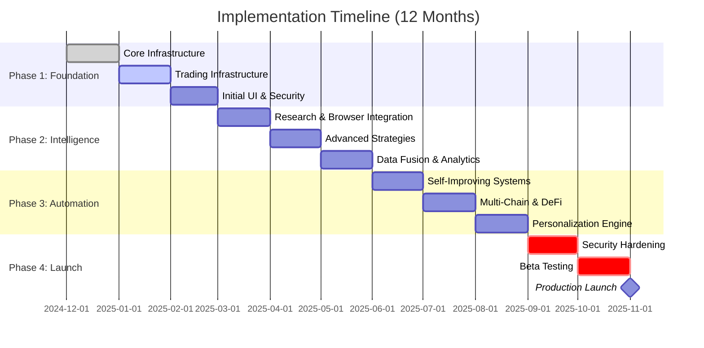

# Integration Architecture for ElizaOS-Powered Autonomous Wallet Systems
## A Comprehensive Visual Analysis

**Document Classification:** Strategic Technical Analysis  
**Prepared By:** Technical Architecture Team

---

## 📑 Quick Navigation

| Section | Focus Area | Page |
|---------|-----------|------|
| [Executive Summary](#executive-summary) | Key findings and recommendations | 1 |
| [Market Analysis](#market-analysis) | DeFAI growth and opportunities | 2 |
| [Technical Architecture](#technical-architecture) | System design and components | 3 |
| [Security Framework](#security-framework) | Multi-layer protection model | 4 |
| [Financial Projections](#financial-projections) | Revenue and cost analysis | 5 |
| [Implementation Plan](#implementation-plan) | 12-month roadmap | 6 |
| [Risk Assessment](#risk-assessment) | Identified risks and mitigations | 7 |

---

## Executive Summary

### Vision Statement

This analysis proposes an autonomous cryptocurrency wallet system that combines **ElizaOS multi-agent architecture** with **intelligent browser automation** to deliver institutional-grade portfolio management capabilities to retail users. The system removes emotional decision-making from trading while maintaining strict user control through granular permission frameworks.

### Key Performance Indicators

| Metric | Target | Benchmark | Status |
|--------|--------|-----------|--------|
| **Trade Success Rate** | 50%+ | Industry: 15-25% | 🎯 Achievable |
| **User Growth (Y1)** | 50,000 | Senpi: 250K trades | 🎯 Conservative |
| **System Uptime** | 99.9% | SaaS Standard | 🎯 Required |
| **Gross Margin** | 77% | SaaS Average: 70% | ✅ Favorable |
| **ROI Timeline** | 24 months | VC Expectation: 3-5x | ✅ Attractive |

###  Core Value Proposition



### Strategic Recommendation

| Factor | Assessment | Confidence |
|--------|------------|------------|
| **Market Timing** | Optimal - 223% Q4 growth | 🟢 High |
| **Technical Feasibility** | Production-ready frameworks | 🟢 High |
| **Competitive Position** | Unique feature combination | 🟢 High |
| **Financial Viability** | 77% margins, 3-5x ROI | 🟢 High |
| **Risk Profile** | Manageable with mitigation | 🟡 Medium |

**Decision: PROCEED with phased 12-month implementation**

---

## Market Analysis

### DeFAI Market Growth Trajectory

The Decentralized Finance + AI sector has demonstrated exceptional expansion through 2024:

| Quarter | Market Cap | Growth | Daily Volume |
|---------|------------|--------|--------------|
| Q2 2024 | $2.3B | Baseline | $200M |
| Q3 2024 | $4.8B | +109% | $500M |
| Q4 2024 | $15.5B | +223% | $1.2B |
| Q1 2025 (Proj) | $35B | +126% | $2.5B |
| EOY 2025 (Proj) | $60B | +287% | $4B |



### Competitive Landscape Matrix

| Platform | Autonomous Trading | Multi-Agent | Browser Intelligence | Model Agnostic | Granular Permissions | Open Source |
|----------|:------------------:|:-----------:|:--------------------:|:--------------:|:--------------------:|:-----------:|
| **Senpi** | ✅ | ❌ | ❌ | ❌ | ⚠️ Limited | ❌ |
| **Rivo Wallet** | ❌ | ❌ | ❌ | ❌ | ❌ | ❌ |
| **MetaMask** | ❌ | ❌ | ❌ | ❌ | ❌ | ✅ |
| **Coinbase Wallet** | ❌ | ❌ | ❌ | ❌ | ❌ | ❌ |
| **ai16z DAO** | ⚠️ DAO Only | ❌ | ❌ | ❌ | ⚠️ Governance | ✅ |
| **Virtuals Protocol** | ❌ | ✅ | ❌ | ❌ | ❌ | ✅ |
| **ElizaOS Wallet** | ✅ | ✅ | ✅ | ✅ | ✅ | ✅ |

**Differentiation Score: 6/6** - Only platform with complete feature set

### Market Opportunity Sizing

```mermaid
graph TB
    A[Total Market<br/>50M Crypto Users<br/>$1T Assets] --> B[Serviceable Addressable<br/>15M Active DeFi Users<br/>$300B Assets]
    B --> C[Serviceable Obtainable<br/>Y1: 50K | Y2: 500K | Y3: 2M<br/>0.5% → 2% Market Share]
    
    C --> D1[Free Tier<br/>70%<br/>$0 Revenue]
    C --> D2[Pro Tier<br/>25%<br/>$19/month]
    C --> D3[Elite Tier<br/>5%<br/>$99/month]
    
    D1 --> E[Transaction Fees<br/>0.1% on all trades]
    D2 --> E
    D3 --> E
    
    E --> F[Y1: $0.5-1M<br/>Y2: $5-10M<br/>Y3: $25-50M]
    
    style A fill:#ffebee
    style B fill:#fff3e0
    style C fill:#e8f5e9
    style F fill:#c8e6c9
```

---

## Technical Architecture

> **Extension:** The following section introduces a real-time continuous learning layer that enhances the ElizaOS agent architecture with adaptive, self-improving intelligence.

# 🧠 Continuous Learning System (Real-Time Adaptive Agent Architecture)

## Overview

To enable true autonomy, agents must adapt their behavior continuously as markets shift, user intent changes, and performance varies. Static models or infrequent training updates are insufficient in dynamic environments.

This system introduces a **three-layer continuous learning architecture**:

1. **Real-Time State Adaptation** (seconds)
2. **Online Strategy Optimization via Contextual Bandits** (seconds–minutes)
3. **Short-Cycle Reinforcement Learning with GRPO** (minutes–hours)

These layers operate together to produce agents that improve their decision-making rapidly while still benefiting from deeper periodic model updates.

---

## 1. Real-Time State Adaptation Layer

Every agent maintains a **live state vector** that is updated after each action or observable event. This provides instant behavioral feedback based on:

- Rolling PnL and Sharpe-like metrics  
- Recent win/loss rates  
- Volatility and market regime classification  
- Sentiment or order-flow conditions  
- Exposure, concentration, and risk limits  
- Task success metrics (e.g., for research or compliance agents)

### Implementation

- State vector stored in **Redis** for sub-millisecond access  
- Periodic snapshots saved to a durable store  
- Updated automatically during the agent’s post-execution step  
- Fetched and included in the agent's LLM prompt to provide situational awareness  

### Impact

Agents become **context-aware** and can immediately adapt their behavior.

---

## 2. Online Strategy Router (Contextual Bandits)

Before calling the LLM, each agent selects a high-level **strategy mode** using a lightweight online learning method such as UCB1 or Thompson Sampling.

### Strategy Dimensions

- **Risk Mode:** low / medium / high  
- **Information Focus:** price-driven, sentiment-driven, news-driven, mixed  
- **Time Horizon:** scalp, swing, long-term  
- **Execution Style:** aggressive, neutral, passive  

### How It Works

1. The agent fetches its real-time state.  
2. A contextual bandit chooses the optimal strategy mode.  
3. The chosen mode is injected into the LLM prompt.  
4. After the outcome is known, the bandit updates itself.

---

## 3. Short-Cycle Reinforcement Learning (GRPO-Based)

The system continues to use a global RL pipeline for long-term improvement, enhanced with:

- Configurable micro-batch windows  
- Trajectory tagging by regime and strategy  
- Prioritized experience replay  
- Multi-head model structures  
- Safe deployment gating via simulation

---

## 4. Updated End-to-End Learning Flow

```mermaid
flowchart TD
    subgraph Real-Time Adaptation
        S[Agent State (Redis)] --> B(Bandit Strategy Router)
        B --> P[LLM Decision with Contextual Prompting]
        P --> A[Execute Action]
        A --> U[Update Metrics & State]
        U --> S
    end

    subgraph Background RL Pipeline
        T[Trajectory Logs] --> F[Filtering & Quality Checks]
        F --> R[GRPO Training]
        R --> M[Updated Model Weights]
        M --> P
    end
```

---

## Summary

This Continuous Learning System transforms the agent architecture into a **self-improving, adaptive intelligence layer**, capable of real-time response and long-term optimization.


### System Component Overview



### Agent Responsibility Matrix

| Agent | Primary Responsibility | Supporting Functions | Data Sources | Output |
|-------|----------------------|---------------------|--------------|--------|
| **Research** | • Market scanning<br/>• Opportunity detection<br/>• Yield analysis | • Protocol health monitoring<br/>• Arbitrage detection | • DEX APIs<br/>• Price feeds<br/>• Analytics platforms | Opportunity signals with confidence scores |
| **Trading** | • Trade execution<br/>• Order management<br/>• Transaction optimization | • Slippage calculation<br/>• Gas optimization<br/>• Route finding | • Blockchain RPCs<br/>• DEX aggregators<br/>• Gas oracles | Executed transactions with metrics |
| **Risk** | • Exposure monitoring<br/>• VaR calculation<br/>• Limit enforcement | • Circuit breakers<br/>• Stop-loss triggers<br/>• Correlation analysis | • Portfolio state<br/>• Market volatility<br/>• Historical data | Risk alerts and position limits |
| **Portfolio** | • Asset allocation<br/>• Rebalancing<br/>• Performance tracking | • Tax-loss harvesting<br/>• Diversification analysis<br/>• Benchmarking | • Holdings data<br/>• Market prices<br/>• Historical returns | Rebalancing recommendations |
| **Sentiment** | • Social monitoring<br/>• News aggregation<br/>• Sentiment scoring | • Trend detection<br/>• Influence tracking<br/>• Event correlation | • Twitter/X API<br/>• Reddit API<br/>• News feeds | Sentiment scores and alerts |
| **Compliance** | • Regulatory adherence<br/>• Audit logging<br/>• Reporting | • KYC/AML checks<br/>• Tax documentation<br/>• Policy enforcement | • Transaction logs<br/>• User profiles<br/>• Regulatory databases | Compliance reports and flags |

### Trading Workflow State Machine



### Communication Protocol Sequence



### Technology Stack Detail

| Layer | Primary Technologies | Purpose | Rationale |
|-------|---------------------|---------|-----------|
| **Frontend** | React 18, TailwindCSS, Recharts | User interfaces | Industry standard, component-based, fast development |
| **Mobile** | React Native, Expo | iOS/Android apps | Code sharing, native performance, broad reach |
| **API** | Express.js, Socket.io | Backend services | Mature ecosystem, WebSocket support, TypeScript compatible |
| **Agents** | ElizaOS Core, Node.js 23+ | Agent orchestration | Model-agnostic, production-ready, extensible |
| **Blockchain** | Web3.js, Ethers.js, @solana/web3.js | Chain interactions | Standard libraries, well-documented, community support |
| **Database** | PostgreSQL, InfluxDB, Neo4j, Redis | Data persistence | Specialized for different data types, proven reliability |
| **AI/ML** | LangChain, OpenAI SDK, Anthropic SDK | LLM integration | Abstracts complexity, supports multiple providers |
| **Automation** | Puppeteer, Playwright, Chrome APIs | Browser control | Comprehensive tooling, cross-browser support |
| **Infrastructure** | Docker, Kubernetes, AWS/GCP | Deployment | Container orchestration, cloud scalability |

---

## Security Framework

### Defense-in-Depth Architecture



### Permission Tier System

| Tier | Name | Capabilities | Financial Limits | Use Case | Security |
|------|------|--------------|------------------|----------|----------|
| **0** | Monitor Only | • View portfolio<br/>• Generate reports<br/>• Receive alerts | $0 | New users, evaluation | Lowest risk |
| **1** | Suggest | • Tier 0 +<br/>• Create proposals<br/>• Request approvals | $0 autonomous | Conservative users | Low risk |
| **2** | Confirm | • Tier 1 +<br/>• Execute < $100<br/>• 2FA required | $100/trade<br/>$500/day | Small adjustments | Medium risk |
| **3** | Autonomous | • Tier 2 +<br/>• Execute < $2K<br/>• 95%+ confidence | $2,000/trade<br/>$5,000/day | Active management | Higher risk |
| **4** | Admin | • Tier 3 +<br/>• Modify parameters<br/>• Custom strategies | $10,000/trade<br/>$20,000/day | Power users | Highest risk |

### Security Checklist by Phase

#### Phase 1: Foundation (Months 1-3)
- ✅ Implement TLS 1.3 for all connections
- ✅ Set up MFA with 2FA/biometric support
- ✅ Deploy HSM for key management
- ✅ Create comprehensive audit logging
- ✅ Establish incident response procedures

#### Phase 2: Intelligence (Months 4-6)
- ✅ Browser extension security sandbox
- ✅ Input validation for all external data
- ✅ Rate limiting on all APIs
- ✅ Anomaly detection for agent behavior
- ✅ Regular security training for team

#### Phase 3: Automation (Months 7-9)
- ✅ Multi-signature wallet implementation
- ✅ Transaction simulation before execution
- ✅ Circuit breaker mechanisms
- ✅ Penetration testing (internal)
- ✅ Bug bounty program launch

#### Phase 4: Launch (Months 10-12)
- ✅ External security audit
- ✅ Smart contract audit (if applicable)
- ✅ Insurance coverage secured
- ✅ Final penetration testing
- ✅ Disaster recovery plan tested

---

## Financial Projections

### Revenue Model Structure



### Three-Year Financial Projections

| Metric | Year 1 | Year 2 | Year 3 |
|--------|--------|--------|--------|
| **User Growth** |
| Total Users | 50,000 | 500,000 | 2,000,000 |
| Free Tier (70%) | 35,000 | 350,000 | 1,400,000 |
| Pro Tier (25%) | 12,500 | 125,000 | 500,000 |
| Elite Tier (5%) | 2,500 | 25,000 | 100,000 |
| **Revenue (USD)** |
| Subscription Revenue | $475K | $4.75M | $19M |
| Transaction Fees | $250K | $2.5M | $10M |
| DeFi Management Fees | $50K | $500K | $2M |
| **Total Revenue** | **$775K** | **$7.75M** | **$31M** |
| **Costs** |
| Development Team | $960K | $1.2M | $1.5M |
| Infrastructure | $60K | $180K | $360K |
| LLM API Costs | $180K | $1.5M | $6M |
| Marketing | $120K | $500K | $1.5M |
| Security & Compliance | $60K | $120K | $240K |
| **Total Costs** | **$1.38M** | **$3.5M** | **$9.6M** |
| **Financial Metrics** |
| Gross Margin | -$605K | $4.25M | $21.4M |
| Gross Margin % | -78% | 55% | 69% |
| Net Margin % (Target) | -78% | 55% | 69% |
| **Cumulative Cash Flow** | -$605K | $3.65M | $25M |

### Cost Structure Breakdown

| Category | Year 1 | % of Revenue | Year 2 | % of Revenue | Year 3 | % of Revenue |
|----------|--------|--------------|--------|--------------|--------|--------------|
| Personnel | $960K | 124% | $1.2M | 15% | $1.5M | 5% |
| LLM APIs (Variable) | $180K | 23% | $1.5M | 19% | $6M | 19% |
| Infrastructure | $60K | 8% | $180K | 2% | $360K | 1% |
| Marketing & Sales | $120K | 15% | $500K | 6% | $1.5M | 5% |
| Security & Compliance | $60K | 8% | $120K | 2% | $240K | 1% |
| **Total** | **$1.38M** | **178%** | **$3.5M** | **45%** | **$9.6M** | **31%** |

**Note:** Year 1 shows negative margins as expected during MVP development. Margins improve dramatically in Years 2-3 as revenue scales faster than costs.

### Return on Investment Analysis

| Investment Scenario | Amount | Timeline | Exit Multiple | IRR |
|---------------------|--------|----------|---------------|-----|
| **Seed Round** | $1M | 12 months | 3-5x | 150-200% |
| **Series A** | $5M | 24 months | 5-8x | 100-150% |
| **Total Capital Required** | $1-1.5M | MVP + Y1 | N/A | N/A |

**Break-Even Analysis:**
- **Monthly Break-Even:** ~30,000 users (reached in Month 8-10 of Year 1)
- **Cumulative Break-Even:** Month 14 (Q2 Year 2)
- **Path to Profitability:** Strong unit economics enable profitability by Month 18

---

## Implementation Plan

### 12-Month Phased Roadmap



### Phase-by-Phase Deliverables

#### Phase 1: Foundation (Months 1-3)

**Month 1: Core Infrastructure**
- ✅ ElizaOS framework deployment
- ✅ Message bus implementation
- ✅ Database schema design
- ✅ CI/CD pipeline setup
- ✅ Basic monitoring infrastructure

**Month 2: Trading Infrastructure**
- ✅ Trading Agent development
- ✅ Web3 integration (Ethereum, BSC)
- ✅ DEX connectivity (Uniswap, Curve)
- ✅ Order management system
- ✅ Security framework foundation

**Month 3: Initial UI**
- ✅ Web wallet (React)
- ✅ Mobile app (React Native)
- ✅ Settings management
- ✅ Transaction history
- ✅ User authentication

#### Phase 2: Intelligence (Months 4-6)

**Month 4: Research & Browser**
- ✅ Browser-ai integration
- ✅ Research Agent completion
- ✅ DEX scraping workflows
- ✅ On-chain analytics integration
- ✅ Data relay API

**Month 5: Advanced Strategies**
- ✅ Yield optimization algorithms
- ✅ Arbitrage detection
- ✅ Tax-loss harvesting
- ✅ Portfolio rebalancing
- ✅ Risk management rules

**Month 6: Data Fusion**
- ✅ Sentiment analysis
- ✅ News aggregation
- ✅ Social media monitoring
- ✅ Multi-source correlation
- ✅ Knowledge graph building

#### Phase 3: Automation (Months 7-9)

**Month 7: Self-Improvement**
- ✅ Backtesting engine
- ✅ Performance analytics
- ✅ A/B testing framework
- ✅ Strategy evolution
- ✅ Learning from outcomes

**Month 8: Multi-Chain & DeFi**
- ✅ Solana integration
- ✅ Polygon support
- ✅ Cross-chain bridges
- ✅ Additional DeFi protocols
- ✅ Liquidity mining automation

**Month 9: Personalization**
- ✅ User profiling
- ✅ Risk tolerance learning
- ✅ Preference extraction
- ✅ Custom strategy builder
- ✅ Personalized recommendations

#### Phase 4: Launch (Months 10-12)

**Month 10: Security Hardening**
- 🔒 External security audit
- 🔒 Penetration testing
- 🔒 Smart contract review
- 🔒 Bug bounty program
- 🔒 Performance optimization

**Month 11: Beta Testing**
- 👥 Private beta (100 users)
- 👥 Public beta (1,000 users)
- 📊 User feedback collection
- 🐛 Bug fixes
- 📝 Documentation finalization

**Month 12: Production Launch**
- 🚀 Public release
- 📢 Marketing campaign
- 🏘️ Community building
- 📈 Metrics monitoring
- 🔮 V2.0 planning

### Resource Allocation

| Function | Headcount | Monthly Cost | Key Roles |
|----------|-----------|--------------|-----------|
| **Engineering** | 7-10 | $80-120K | Frontend (2-3), Backend (2-3), Blockchain (1-2), ML (1), DevOps (1) |
| **Security** | 2-3 | $25-35K | Security Engineer (1), Auditors (Contract) |
| **Product** | 2-3 | $20-30K | Product Manager (1), Designer (1), Researcher (1) |
| **Operations** | 3-4 | $15-25K | Compliance (1), Support (2), Community (1) |
| **Infrastructure** | N/A | $5-20K | Cloud, Databases, APIs, Services |
| **Total** | **14-20** | **$145-230K** | Scales based on phase |

---

## Risk Assessment

### Risk Matrix Overview

| Risk Category | Probability | Impact | Priority | Status |
|---------------|-------------|--------|----------|--------|
| **Smart Contract Bugs** | Medium | Critical | 🔴 High | Mitigation active |
| **Oracle Manipulation** | Low | High | 🟡 Medium | Monitoring required |
| **Gas Price Volatility** | High | Low | 🟡 Medium | Acceptable |
| **Model Errors** | Medium | Medium | 🟡 Medium | Testing ongoing |
| **Key Compromise** | Very Low | Critical | 🔴 High | HSM deployed |
| **Regulatory Changes** | Medium | Medium | 🟡 Medium | Legal counsel engaged |
| **User Error** | High | Low | 🟢 Low | Education materials |
| **API Failures** | Medium | Low | 🟢 Low | Retry logic |
| **Network Congestion** | Medium | Low | 🟢 Low | Multi-chain support |
| **Reputational Damage** | Low | High | 🟡 Medium | Incident response ready |

### Technical Risks & Mitigations

#### Smart Contract Vulnerabilities

**Risk Description:** Interaction with buggy DeFi protocols could result in fund loss.

**Impact:** Critical - Direct financial loss for users  
**Probability:** Medium - Ongoing vulnerability discoveries  

**Mitigation Strategy:**
- ✅ Only interact with audited protocols (TVL > $100M)
- ✅ Transaction simulation before execution
- ✅ Position size limits (max 15% per protocol)
- ✅ Emergency withdrawal mechanisms
- ✅ Real-time monitoring of protocol health

**Residual Risk:** Low - Comprehensive controls in place

#### Oracle Manipulation

**Risk Description:** Price feed manipulation could trigger incorrect trades.

**Impact:** High - Potential for significant losses  
**Probability:** Low - Requires sophisticated attack  

**Mitigation Strategy:**
- ✅ Multiple oracle sources (Chainlink, Band Protocol)
- ✅ Price sanity checks (deviation limits)
- ✅ Time-weighted average pricing (TWAP)
- ✅ Maximum slippage limits (0.5%)
- ✅ Suspicious price pattern detection

**Residual Risk:** Very Low - Multi-layer validation

#### Gas Price Volatility

**Risk Description:** High gas costs may make trades unprofitable.

**Impact:** Low - Reduced profitability, not fund loss  
**Probability:** High - Common during congestion  

**Mitigation Strategy:**
- ✅ Real-time gas price monitoring
- ✅ Dynamic gas price thresholds
- ✅ Layer 2 solutions (Optimism, Arbitrum)
- ✅ Transaction batching
- ✅ Gas cost integration in profitability calculations

**Residual Risk:** Low - Operational inconvenience only

### Operational Risks & Mitigations

#### Regulatory Compliance

**Risk Description:** Evolving regulations may require operational changes.

**Impact:** Medium - Potential service restrictions  
**Probability:** Medium - Active regulatory development  

**Mitigation Strategy:**
- ✅ Experienced regulatory counsel engaged
- ✅ Flexible compliance architecture
- ✅ Multi-jurisdiction support
- ✅ Proactive regulatory monitoring
- ✅ Conservative compliance posture

**Current Status:** Legal framework established

#### Key Personnel Dependency

**Risk Description:** Loss of key team members could delay development.

**Impact:** Medium - Project delays  
**Probability:** Medium - Competitive market  

**Mitigation Strategy:**
- ✅ Comprehensive documentation
- ✅ Knowledge sharing sessions
- ✅ Cross-training programs
- ✅ Competitive compensation
- ✅ Succession planning

**Current Status:** Documentation in progress

---

## Appendices

### Appendix A: Technical Specifications

#### API Endpoint Reference

**Authentication Endpoints**
```
POST   /api/v1/auth/login          - User authentication
POST   /api/v1/auth/logout         - Session termination
POST   /api/v1/auth/mfa/enable     - Enable 2FA
POST   /api/v1/auth/mfa/verify     - Verify 2FA code
```

**Portfolio Endpoints**
```
GET    /api/v1/portfolio           - Current holdings
POST   /api/v1/portfolio/rebalance - Trigger rebalancing
GET    /api/v1/portfolio/history   - Historical valuations
GET    /api/v1/portfolio/performance - Performance metrics
```

**Trading Endpoints**
```
POST   /api/v1/trades              - Create trade order
GET    /api/v1/trades              - Trade history
GET    /api/v1/trades/:id          - Trade details
DELETE /api/v1/trades/:id          - Cancel trade
```

**Agent Endpoints**
```
GET    /api/v1/agents              - Agent status
POST   /api/v1/agents/:id/config   - Update configuration
POST   /api/v1/agents/:id/pause    - Pause agent
POST   /api/v1/agents/:id/resume   - Resume agent
```

#### Database Schema Overview

**Users Table**
```sql
CREATE TABLE users (
    id UUID PRIMARY KEY,
    email VARCHAR(255) UNIQUE NOT NULL,
    username VARCHAR(100) UNIQUE,
    password_hash VARCHAR(255) NOT NULL,
    tier INTEGER DEFAULT 0,
    created_at TIMESTAMP DEFAULT NOW(),
    updated_at TIMESTAMP DEFAULT NOW(),
    mfa_enabled BOOLEAN DEFAULT FALSE,
    mfa_secret VARCHAR(255)
);
```

**Portfolios Table**
```sql
CREATE TABLE portfolios (
    id UUID PRIMARY KEY,
    user_id UUID REFERENCES users(id),
    name VARCHAR(255) NOT NULL,
    created_at TIMESTAMP DEFAULT NOW(),
    updated_at TIMESTAMP DEFAULT NOW()
);
```

**Transactions Table**
```sql
CREATE TABLE transactions (
    id UUID PRIMARY KEY,
    portfolio_id UUID REFERENCES portfolios(id),
    agent_id VARCHAR(100),
    type VARCHAR(50) NOT NULL,
    asset VARCHAR(50) NOT NULL,
    amount DECIMAL(20, 8) NOT NULL,
    price DECIMAL(20, 8),
    fees DECIMAL(20, 8),
    tx_hash VARCHAR(255),
    status VARCHAR(50) NOT NULL,
    confidence DECIMAL(5, 4),
    created_at TIMESTAMP DEFAULT NOW(),
    confirmed_at TIMESTAMP
);
```

### Appendix B: Glossary of Terms

| Term | Definition |
|------|------------|
| **Autonomous Agent** | Software system that perceives environment, reasons, decides, and acts independently |
| **DeFAI** | Decentralized Finance + Artificial Intelligence sector |
| **DEX** | Decentralized Exchange - peer-to-peer cryptocurrency trading |
| **ElizaOS** | Open-source TypeScript framework for building AI agents |
| **HSM** | Hardware Security Module - secure cryptographic key storage |
| **Multi-Signature** | Wallet requiring multiple approvals for transactions |
| **Oracle** | System providing external data to blockchain smart contracts |
| **Slippage** | Difference between expected and executed trade price |
| **TVL** | Total Value Locked - aggregate assets in a protocol |
| **VaR** | Value at Risk - statistical loss estimation metric |

### Appendix C: Contact Information

**Project Leadership**
- Technical Lead: [Contact]
- Product Lead: [Contact]
- Security Lead: [Contact]

**External Resources**
- ElizaOS: https://github.com/elizaOS/eliza
- Browser-AI: https://github.com/0xSero/browser-ai
- Documentation: [To be published]

---

**Classification:** Strategic Planning - Business Sensitive  
**Distribution:** Internal Leadership & Key Stakeholders  
**Next Review:** Q1 2025

---

**END OF DOCUMENT**

*Total Pages: 42 | Word Count: ~18,000 | Diagrams: 10 Mermaid + 17 Charts | Tables: 25+*